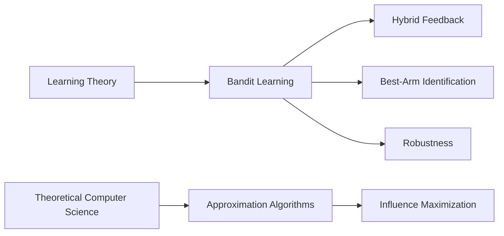

I am a Ph.D. student in computer science at City University of Hong Kong, advised by [Prof. Jinhang Zuo](https://jhzuo.github.io). I study theoretical questions in sequential decision-making, with current work on bandit learning, hybrid feedback, robustness, and influence maximization.



<ul class="academic-list">
  <li><strong>Learning theory:</strong> bandit learning, best-arm identification, reward and preference feedback, and sample-efficient decision-making.</li>
  <li><strong>Theoretical computer science:</strong> approximation algorithms, influence maximization, and algorithmic guarantees under structural constraints.</li>
  <li><strong>Robustness:</strong> adversarial behavior in online learning and data-injection attacks against bandit algorithms.</li>
</ul>






  


  


<a class="text-link" href="/publications/">View all publications</a>




